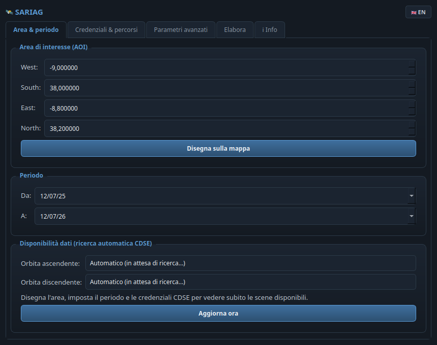
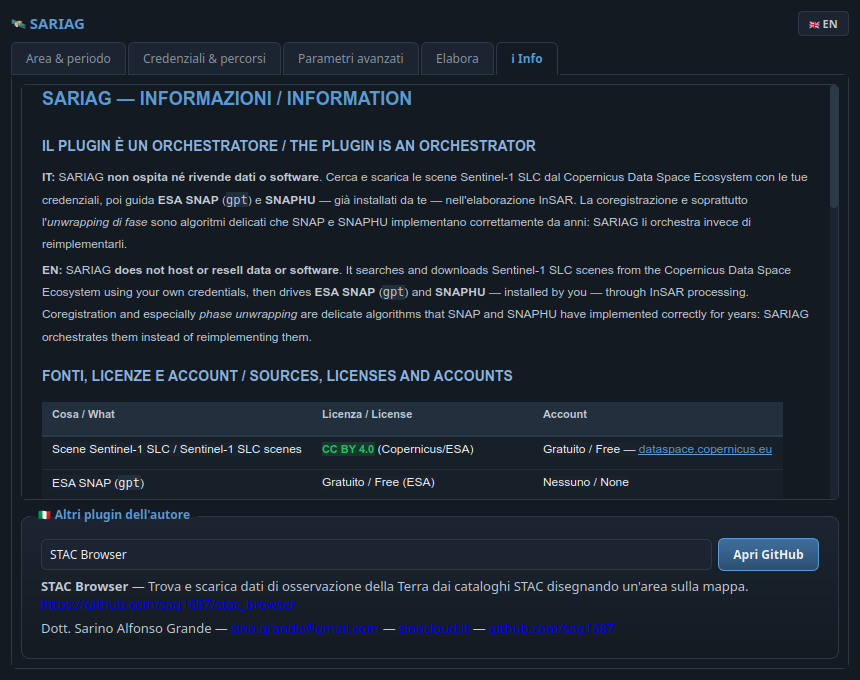

# 🛰️ SARIAG for QGIS

[](https://qgis.org/)
[](#-requisiti--requirements)
[](https://www.gnu.org/licenses/old-licenses/gpl-2.0.en.html)
[](https://www.riverbankcomputing.com/software/pyqt/)
[](https://flake8.pycqa.org/)
[](#)

> **IT** · Disegna un'area su QGIS, imposta un periodo: SARIAG cerca **automaticamente** su Copernicus Data Space Ecosystem le scene Sentinel-1 SLC disponibili (ascendenti e discendenti), le scarica, guida ESA SNAP e SNAPHU nell'elaborazione InSAR multi-temporale e restituisce due mappe pronte per QGIS — **spostamento Verticale** e **spostamento Est-Ovest**.
>
> **EN** · Draw an area in QGIS, set a date range: SARIAG **automatically** searches the Copernicus Data Space Ecosystem for available Sentinel-1 SLC scenes (ascending and descending), downloads them, drives ESA SNAP and SNAPHU through multi-temporal InSAR processing and returns two QGIS-ready maps — **Vertical displacement** and **East-West displacement**.

**🌐 Lingua / Language:** [🇮🇹 Italiano](#-italiano) · [🇬🇧 English](#-english)

---

## 🇮🇹 Italiano

### Cos'è
**SARIAG** è un plugin per QGIS, fratello di [STAC Browser](../SAR) dello stesso autore, che porta dentro QGIS un flusso di **interferometria SAR multi-temporale** (tipo SBAS) su Sentinel-1, senza dover conoscere in anticipo tutti i passaggi manuali di ESA SNAP.

### A cosa serve
- 📡 Misurare **spostamenti del terreno** (subsidenza, frane, sollevamento) da serie temporali Sentinel-1, senza costruire a mano ogni interferogramma.
- 🧭 Ottenere **due componenti geodeticamente separate** — Verticale ed Est-Ovest — combinando automaticamente orbita ascendente e discendente.
- ⚙️ **Automatizzare** ricerca, download, coregistrazione, formazione degli interferogrammi, unwrapping e inversione della serie temporale, mantenendo SNAP e SNAPHU (già validati dalla comunità InSAR) come motore di calcolo.

### ✨ Funzionalità principali
| | Funzionalità | Descrizione |
|---|---|---|
| 🔄 | **Ricerca automatica CDSE** | Appena AOI, periodo e credenziali sono validi, SARIAG interroga da solo il Copernicus Data Space Ecosystem (come la "ricerca automatica" di STAC Browser) e mostra le orbite relative disponibili con conteggio scene. |
| ▭ | **Disegno area sulla mappa** | Bottone "Disegna sulla mappa" per tracciare l'AOI direttamente sul canvas QGIS. |
| 🛰️ | **Download SLC ascendente + discendente** | Scarica automaticamente entrambe le geometrie sulla stessa orbita relativa, necessarie per la scomposizione 3D. |
| 🧩 | **Orchestrazione SNAP/SNAPHU** | Genera i grafi `gpt` (coregistrazione TOPS, interferogramma, deburst, filtro Goldstein) e lancia `snaphu` per l'unwrapping — stesso flusso della GUI di SNAP, ma automatizzato. |
| 📈 | **Inversione serie temporale (SBAS-like)** | Rete a baseline corta invertita con pseudo-inversa (minimo-norma), tollerante a reti ridondanti o con buchi. |
| 🧭 | **Scomposizione Est-Ovest / Verticale** | Combina LOS ascendente e discendente per separare le due componenti (limite fisico noto: la componente Nord-Sud non è misurabile con orbite quasi polari). |
| 🎨 | **Stile automatico dei risultati** | I raster di spostamento vengono caricati in QGIS con rampa colore divergente (blu–bianco–rosso), simmetrica sullo zero. |
| 🔍 | **Rilevamento/installazione automatica strumenti** | "Rileva" trova un'installazione SNAP/SNAPHU già presente; "Installa" scarica e compila SNAPHU in locale (gratuito, nessun account richiesto oltre a CDSE). |
| 🌐 | **Interfaccia bilingue IT/EN** | Pulsante in alto a destra per passare da italiano a inglese in tempo reale su tutta l'interfaccia. |
| ℹ️ | **Scheda Info** | Spiega cosa fa il plugin, fonti/licenze/account, come funziona la pipeline e i limiti noti — sempre bilingue. |
| 🖥️ | **Linux e Windows** | Percorsi, estensioni eseguibili (`.exe`) e toolchain di compilazione gestiti per entrambe le piattaforme. |

### 🛠️ Installazione
1. Copia l'intera cartella `SARIAG` in `~/.local/share/QGIS/QGIS3/profiles/default/python/plugins/` (Linux) o `%APPDATA%\QGIS\QGIS3\profiles\default\python\plugins\` (Windows).
2. In QGIS: **Plugin → Gestisci e installa plugin → Installati** → spunta **SARIAG**.
3. Apri il plugin, scheda **Credenziali & percorsi**: premi **Rileva** per gpt/SNAPHU (o **Installa** per SNAPHU, o **Scarica SNAP** per aprire la pagina ufficiale se non è ancora installato), inserisci le credenziali CDSE, **Salva**.

### 🚀 Utilizzo rapido
1. **Area & periodo** — disegna l'AOI, imposta le date. La disponibilità dati appare da sola.
2. **Credenziali & percorsi** — CDSE + percorsi gpt/snaphu + cartella di lavoro.
3. **Parametri avanzati** — valori di default adatti per iniziare.
4. **Elabora** — *Avvia elaborazione*: al termine, i layer **Spostamento Verticale** ed **Spostamento Est-Ovest** vengono caricati in QGIS.

### ⚠️ Attribuzione richiesta
I dati Sentinel-1 sono © Copernicus / ESA, liberi e gratuiti (CC BY 4.0) ma con **obbligo di attribuzione**. SARIAG non ospita né ridistribuisce dati: li scarica dal Copernicus Data Space Ecosystem con le tue credenziali.

---

## 🇬🇧 English

### What it is
**SARIAG** is a QGIS plugin, sibling of the same author's [STAC Browser](../SAR), that brings a **multi-temporal SAR interferometry** workflow (SBAS-style) on Sentinel-1 into QGIS, without requiring prior knowledge of every manual ESA SNAP step.

### What it is for
- 📡 Measuring **ground displacement** (subsidence, landslides, uplift) from Sentinel-1 time series, without hand-building every interferogram.
- 🧭 Getting **two geodetically separated components** — Vertical and East-West — by automatically combining ascending and descending orbits.
- ⚙️ **Automating** search, download, coregistration, interferogram formation, unwrapping and time series inversion, while keeping SNAP and SNAPHU (already validated by the InSAR community) as the computing engine.

### ✨ Key features
| | Feature | Description |
|---|---|---|
| 🔄 | **Automatic CDSE search** | As soon as the AOI, date range and credentials are valid, SARIAG queries the Copernicus Data Space Ecosystem on its own (like STAC Browser's "automatic search") and shows the available relative orbits with scene counts. |
| ▭ | **Draw area on the map** | "Draw on map" button to trace the AOI directly on the QGIS canvas. |
| 🛰️ | **Ascending + descending SLC download** | Automatically downloads both geometries on the same relative orbit, needed for the 3D decomposition. |
| 🧩 | **SNAP/SNAPHU orchestration** | Generates the `gpt` graphs (TOPS coregistration, interferogram, deburst, Goldstein filter) and runs `snaphu` for unwrapping — the same workflow as the SNAP GUI, automated. |
| 📈 | **Time series inversion (SBAS-like)** | Small-baseline network inverted via pseudo-inverse (minimum-norm), tolerant of redundant or gapped networks. |
| 🧭 | **East-West / Vertical decomposition** | Combines ascending and descending LOS to separate the two components (known physical limit: the North-South component cannot be measured with near-polar orbits). |
| 🎨 | **Automatic result styling** | Displacement rasters are loaded into QGIS with a diverging (blue–white–red) colour ramp, symmetric around zero. |
| 🔍 | **Auto-detect/install tools** | "Detect" finds an existing SNAP/SNAPHU install; "Install" downloads and builds SNAPHU locally (free, no account needed beyond CDSE). |
| 🌐 | **Bilingual IT/EN interface** | Top-right toggle button switches the whole interface between Italian and English in real time. |
| ℹ️ | **Info tab** | Explains what the plugin does, sources/licenses/accounts, how the pipeline works and known limitations — always bilingual. |
| 🖥️ | **Linux and Windows** | Paths, executable extensions (`.exe`) and build toolchain handled for both platforms. |

### 🛠️ Installation
1. Copy the whole `SARIAG` folder into `~/.local/share/QGIS/QGIS3/profiles/default/python/plugins/` (Linux) or `%APPDATA%\QGIS\QGIS3\profiles\default\python\plugins\` (Windows).
2. In QGIS: **Plugins → Manage and Install Plugins → Installed** → tick **SARIAG**.
3. Open the plugin, **Credentials & paths** tab: click **Detect** for gpt/SNAPHU (or **Install** for SNAPHU, or **Download SNAP** to open the official page if not installed yet), enter your CDSE credentials, **Save**.

### 🚀 Quick start
1. **Area & date range** — draw the AOI, set the dates. Data availability appears on its own.
2. **Credentials & paths** — CDSE + gpt/snaphu paths + work folder.
3. **Advanced parameters** — the defaults are fine to start with.
4. **Run** — *Run*: when done, the **Vertical Displacement** and **East-West Displacement** layers are loaded into QGIS.

### ⚠️ Required attribution
Sentinel-1 data is © Copernicus / ESA, free and open (CC BY 4.0) but **attribution is required**. SARIAG does not host or redistribute data: it downloads it from the Copernicus Data Space Ecosystem using your own credentials.

---

## ⚖️ Fonti, licenze e account / Sources, licenses and accounts

> **IT** · SARIAG è **solo un orchestratore**: non ospita né rivende dati o software. Le scene Sentinel-1 restano di Copernicus/ESA (CC BY 4.0, attribuzione richiesta); SNAP è di ESA; SNAPHU è distribuito dai suoi autori (Stanford/GINA-Alaska Satellite Facility) — leggi le rispettive licenze prima dell'uso.
>
> **EN** · SARIAG is **only an orchestrator**: it does not host or resell data or software. Sentinel-1 scenes remain Copernicus/ESA's (CC BY 4.0, attribution required); SNAP is ESA's; SNAPHU is distributed by its authors (Stanford/GINA-Alaska Satellite Facility) — read their respective licenses before use.

| | Cosa / What | Costo / Cost | Account |
|---|---|---|---|
| 🛰️ | Scene Sentinel-1 SLC / Sentinel-1 SLC scenes | Gratuito / Free | [dataspace.copernicus.eu](https://dataspace.copernicus.eu/) |
| 🧰 | ESA SNAP (`gpt`) | Gratuito / Free | Nessuno (download diretto) / None (direct download) |
| 🧩 | SNAPHU (unwrapping) | Gratuito / Free | Nessuno (build locale) / None (local build) |

## 🧩 How it works / Come funziona

```
      Disegna AOI ▭ + periodo + credenziali CDSE
                       │
      (Ricerca automatica CDSE — asc & desc, QThread)
                       │
      Orbita ascendente scelta        Orbita discendente scelta
              │                                │
   Download SLC (CDSE)               Download SLC (CDSE)
              │                                │
   Per ogni coppia consecutiva:      Per ogni coppia consecutiva:
   gpt (coreg+ifg+Goldstein)         gpt (coreg+ifg+Goldstein)
              │                                │
   snaphu (unwrapping)               snaphu (unwrapping)
              │                                │
   gpt (import+geocodifica)          gpt (import+geocodifica)
              │                                │
   Inversione serie temporale        Inversione serie temporale
   (SBAS, pseudo-inversa) → LOS asc  (SBAS, pseudo-inversa) → LOS desc
              └────────────────┬───────────────┘
                                │
              Scomposizione LOS asc + desc (Cramer)
                                │
              Vertical.tif  +  EastWest.tif → QGIS
```

## 📁 Project structure / Struttura del progetto
| File | Role |
|---|---|
| `plugin.py` | Entry point, toolbar action, map-tool activation. |
| `dialog.py` | Main dialog (4 tabs), background workers, availability search, install helpers wiring. |
| `pipeline.py` | End-to-end orchestration: search → download → SNAP/SNAPHU → inversion → decomposition. |
| `core_cdse.py` | Copernicus Data Space Ecosystem auth, OData search, product download. |
| `snap_graph.py` | `gpt` XML graph generation + subprocess orchestration, SNAPHU unwrap driver. |
| `timeseries.py` | Small-baseline network inversion (pseudo-inverse), velocity estimation. |
| `decompose.py` | Ascending+descending LOS → Vertical/East-West closed-form decomposition. |
| `raster_utils.py` | Shared GDAL helpers (band read, grid warp, GeoTIFF write). |
| `install_helpers.py` | Cross-platform (Linux/Windows) SNAP/SNAPHU auto-detect and SNAPHU auto-build. |
| `map_tool.py` | `DrawBboxTool`, `DrawPointTool`. |
| `qt_compat.py` | PyQt5/PyQt6 enum compatibility shim. |

## 🧪 Development / Sviluppo
```bash
# Lint (configuration in setup.cfg, max-line-length = 100)
flake8 .

# Syntax check every module
python -m py_compile *.py
```

## ❓ FAQ
**IT — Serve una GPU?** No. SNAP e SNAPHU lavorano su CPU e RAM; contano più i core CPU e la RAM (8–16 GB consigliati) che una scheda video.
**EN — Do I need a GPU?** No. SNAP and SNAPHU run on CPU and RAM; CPU cores and RAM (8–16 GB recommended) matter, not a graphics card.

**IT — Il risultato Verticale sembra invertito.** Cambia "Segno verticale" nella scheda Parametri avanzati: dipende dalla versione di SNAP installata (vedi Limiti noti).
**EN — The Vertical result looks inverted.** Flip "Vertical sign" in the Advanced Parameters tab: it depends on the installed SNAP version (see Known limitations).

**IT — Quanto spazio disco/tempo serve?** Ogni scena SLC pesa ~4–5 GB; una elaborazione tipica ne scarica una decina e ogni coppia interferometrica richiede decine di minuti–ore.
**EN — How much disk space/time is needed?** Each SLC scene is ~4–5 GB; a typical run downloads a dozen or so, and each interferometric pair takes tens of minutes to hours.

## Limiti noti (v0.1) / Known limitations (v0.1)

- **Convenzione del segno / Sign convention**: se lo spostamento verticale risulta invertito rispetto a un riferimento noto, cambiare "Segno verticale" — dipende dalla versione di SNAP installata. / If the vertical result comes out inverted against a known reference, flip "Vertical sign" — it depends on the installed SNAP version.
- **Componente Nord-Sud / North-South component**: non calcolata — limite fisico intrinseco delle orbite quasi polari, non una scelta implementativa. / Not computed — an intrinsic physical limit of near-polar orbits, not an implementation shortcut.
- **Rete SBAS / SBAS network**: v0.1 usa la catena di coppie consecutive più semplice (N acquisizioni → N-1 interferogrammi). / v0.1 uses the simplest consecutive-pair chain (N acquisitions → N-1 interferograms).
- **Barra di progresso / Progress bar**: mostra la fase corrente, non l'avanzamento complessivo (che può durare ore). / Shows the current stage, not the whole run's progress (which can take hours).
- **Compilazione SNAPHU su Windows / Building SNAPHU on Windows**: richiede MSYS2 (o WSL) perché Windows non include un compilatore C di serie. / Requires MSYS2 (or WSL) since Windows has no C compiler out of the box.

## 📸 Screenshot

| Scheda "Area & periodo" / "Area & dates" tab | Scheda Info con menù a tendina / Info tab with drop-down |
|---|---|
|  |  |

> **IT** · A sinistra la scheda principale con AOI, periodo e ricerca automatica CDSE; a destra la scheda Info con il menù a tendina degli altri plugin dell'autore. · **EN** · On the left the main tab with AOI, date range and automatic CDSE search; on the right the Info tab with the drop-down of the author's other plugins.

## 👤 Autore / Author
Sviluppato da / Developed by **Dott. Sarino Alfonso Grande**.
- ✉️ **Email:** [sino.grande@gmail.com](mailto:sino.grande@gmail.com)
- 🌐 **Sito ufficiale / Official website:** [sinocloud.it](https://sinocloud.it)
- 🐙 **GitHub:** [sag1687](https://github.com/sag1687)

### Altri plugin dell'autore / Other plugins by the author
| Plugin | Repository |
|---|---|
| **STAC Browser** | [github.com/sag1687/stac_browser](https://github.com/sag1687/stac_browser) |
| **GeoBridge** | [github.com/sag1687/geobridge](https://github.com/sag1687/geobridge) |
| **Quick CRS Fixer** | [github.com/sag1687/CRS_FIXER](https://github.com/sag1687/CRS_FIXER) |
| **GeoCSV Mapper** | [github.com/sag1687/GeoCSV-Mapper](https://github.com/sag1687/GeoCSV-Mapper) |
| **Q-Press** | [github.com/sag1687/q_press](https://github.com/sag1687/q_press) |
| **QGIS Ledger** | [github.com/sag1687/qgis_ledger](https://github.com/sag1687/qgis_ledger) |
| **TAF Italia** | [github.com/sag1687/TAF_ITALIA_DOWNLOAD](https://github.com/sag1687/TAF_ITALIA_DOWNLOAD) |

## 📜 Licenza / License
**GPL-2.0** — Copyright © 2026 Dott. Sarino Alfonso Grande.
Questo plugin è software libero, ridistribuibile secondo i termini della GNU GPL v2. / This plugin is free software, redistributable under the terms of the GNU GPL v2.

---
*Progettato con un'interfaccia scura "slate blue" (ispirata a "Ocean Depth" di STAC Browser, ma con toni più tenui e testo bianco) e compatibilità estesa Qt5/Qt6, Linux/Windows. / Designed with a "slate blue" dark interface (inspired by STAC Browser's "Ocean Depth", but in softer tones with white text) and extended Qt5/Qt6, Linux/Windows compatibility.*
